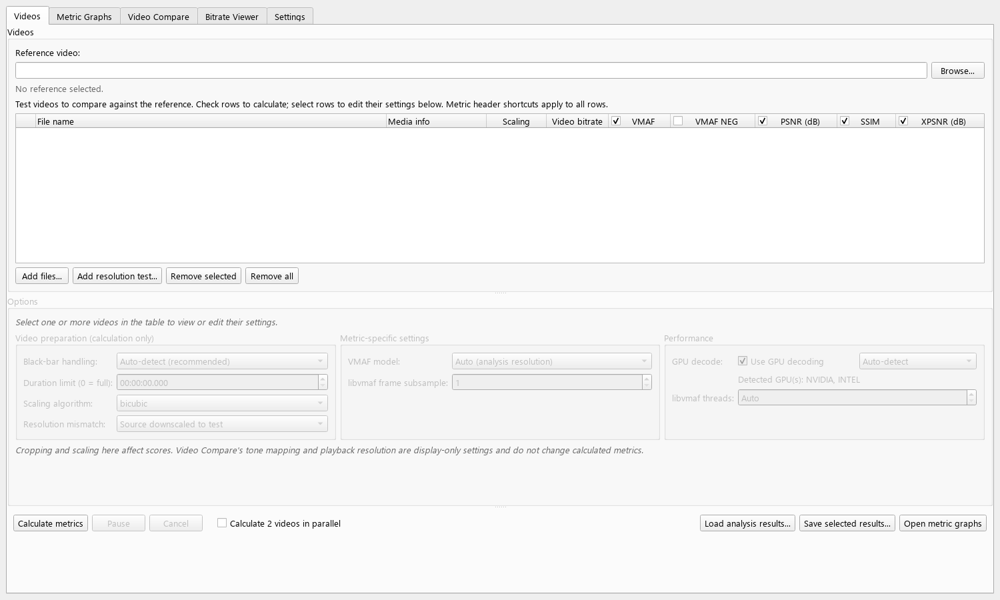

# VideoMetricsLab

A Windows desktop app for measuring and comparing video encode quality.



## Features

- Calculate **VMAF, VMAF NEG, PSNR, SSIM, and XPSNR** for multiple test videos.
- Compare metric curves, statistics, and per-frame scores.
- Switch between synchronized source and test video playback for visual A/B comparisons.
- Inspect bitrate by frame, second, or GOP without running quality metrics.
- Detect black bars and handle resolution mismatches automatically.
- Use GPU decoding when supported, with independent software fallback per input.
- Calculate two test videos in parallel on many-core CPUs.
- Cache completed results and restore them when matching videos are loaded again.

## Quick start

1. Select a reference video.
2. Add one or more test videos.
3. Choose the metrics to calculate.
4. Click **Calculate metrics**.

Results appear in the video table and Metric Graphs tab as each test finishes.
Video Compare and Bitrate Viewer can also be used without calculating metrics.

For detailed instructions, see the [User Guide](docs/USER_GUIDE.md).

## Install

### Packaged release

Download the Windows zip from the [latest release](https://github.com/4KVCD/VideoMetricsLab/releases/latest),
extract it, and run `VideoMetricsLab.exe`.

The app requires **FFmpeg 9 or newer with libvmaf**. FFmpeg is not bundled; the
app prompts for its location if it is not available on `PATH`.

### Run from source

Requires Python 3.11 or newer:

```powershell
py -3 -m venv .venv
.venv\Scripts\python.exe -m pip install -r requirements.txt
.venv\Scripts\python.exe -m vmaf_app.main
```

## Requirements

- Windows 10 or 11
- FFmpeg 9+ with `ffmpeg`, `ffprobe`, and `libvmaf`
- Optional NVIDIA, Intel, or AMD GPU for hardware decoding
- Python 3.11+ when running from source

## Development

```powershell
.venv\Scripts\python.exe -m pip install -r requirements-dev.txt
.venv\Scripts\python.exe -m pytest
.venv\Scripts\python.exe -m ruff check vmaf_app tests scripts
```

Build the distributable with `./scripts/build_release.ps1`. See the
[build guide](docs/BUILD.md) and [contributing guide](CONTRIBUTING.md) for more.

## Documentation

[User Guide](docs/USER_GUIDE.md) ·
[Troubleshooting](docs/TROUBLESHOOTING.md) ·
[Known Issues](docs/KNOWN_ISSUES.md) ·
[Architecture](docs/ARCHITECTURE.md) ·
[Changelog](CHANGELOG.md) ·
[Security](SECURITY.md)

## License

Licensed under the [MIT License](LICENSE). Copyright (c) 2026 **4KVCD**.
Third-party components retain their own licenses; see
[Third-Party Notices](docs/THIRD_PARTY.md).
