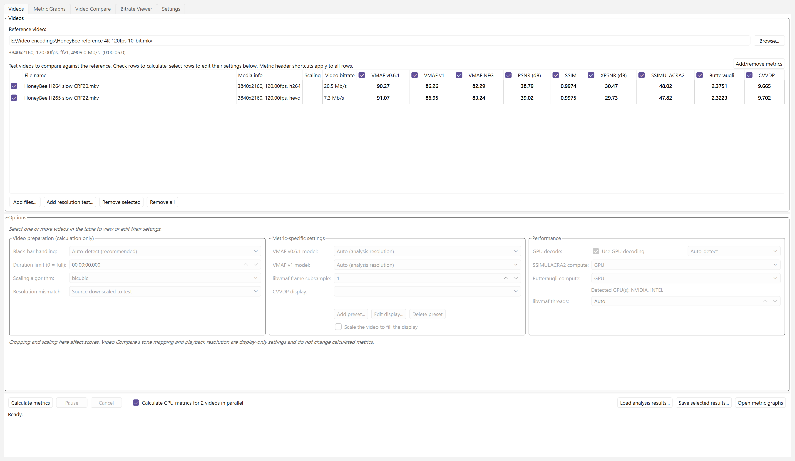
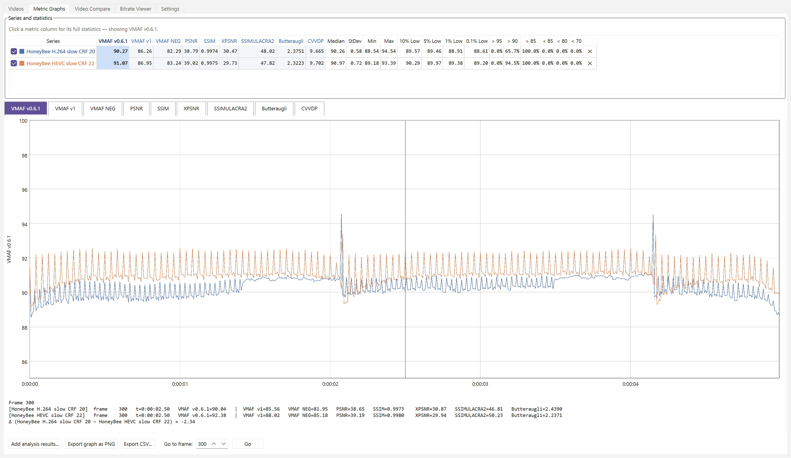
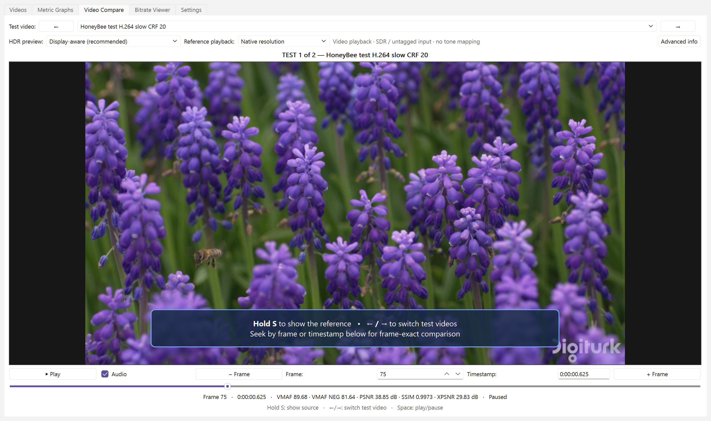
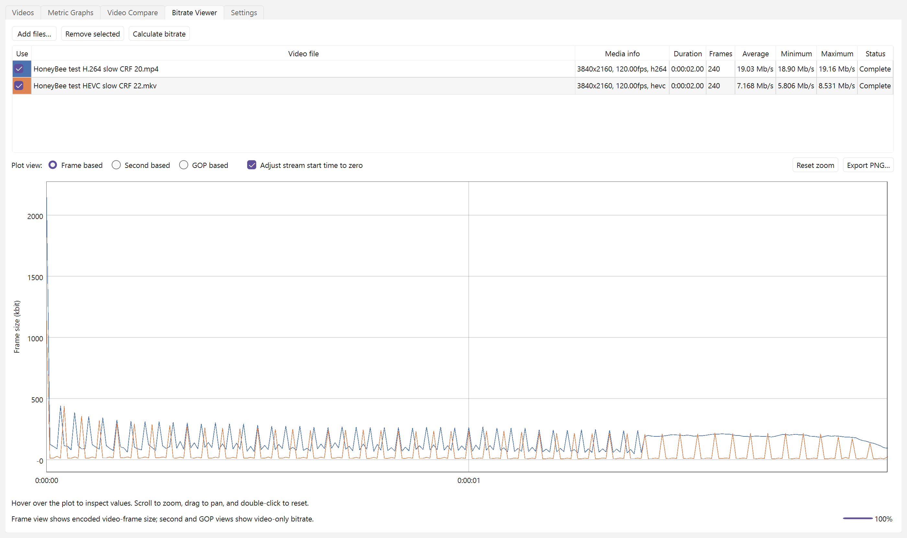

# VideoMetricsLab

A Windows desktop app for measuring and comparing video encode quality.

## Features

- Calculate VMAF, VMAF NEG, PSNR, SSIM, XPSNR, SSIMULACRA2, Butteraugli, and ColorVideo VDP for multiple test videos.
- VShip integration for GPU acceleration for ColorVideo VDP, SSIMULACRA2, and Butteraugli
- libjxl integration for CPU fallback for SSIMULACRA2, and Butteraugli (no CPU support for ColorVideo VDP)
- VMAF v0.6.1 and v1 models for standard, phone, 4K, and HFR viewing scenarios.
- Compare metric curves, statistics, and per-frame scores (per second for ColorVideo VDP).
- Switch instantly between the source and test videos during playback, hold **S** to show the source, or inspect exact frames.
- Inspect bitrate independently by frame, second, or GOP.
- Detect black bars and handle resolution mismatches automatically.
- Use GPU decoding with independent software fallback per input.
- Calculate two test videos in parallel on many-core CPUs.
- Cache completed results and restore them when matching videos are loaded again.

## Videos

Configure each test independently, inspect its codec and bitrate, and calculate
multiple quality metrics in one run.



## Metric graphs

Compare real per-frame curves and distribution statistics. The frame readout
shows both test values and their signed delta at the same moment.



## Video Compare

Switch instantly between the reference and test encodes during playback, or
seek to an exact frame for close inspection.



## Bitrate Viewer

Analyze video-only bitrate independently by frame, second, or GOP.



## Quick start

1. Select a reference video.
2. Add one or more test videos.
3. Choose the metrics to calculate.
4. Click **Calculate metrics**.

Results appear in the video table and Metric Graphs tab as each test finishes.
Video Compare and Bitrate Viewer can also be used without calculating metrics.

For detailed instructions, see the [User Guide](docs/USER_GUIDE.md).

## Install

### Packaged release

Download the Windows zip from the [latest release](https://github.com/4KVCD/VideoMetricsLab/releases/latest),
extract it, and run `VideoMetricsLab.exe`.

The app requires **FFmpeg 9 or newer with libvmaf**. FFmpeg is not bundled; the
app prompts for its location if it is not available on `PATH`.

### Run from source

Requires Python 3.11 or newer:

```powershell
py -3 -m venv .venv
.venv\Scripts\python.exe -m pip install -r requirements.txt
.venv\Scripts\python.exe -m vmaf_app.main
```

## Requirements

- Windows 10 or 11
- FFmpeg 9+ with `ffmpeg`, `ffprobe`, and `libvmaf`
- Optional NVIDIA, Intel, or AMD GPU for hardware decoding
- Python 3.11+ when running from source

## Development

```powershell
.venv\Scripts\python.exe -m pip install -r requirements-dev.txt
.venv\Scripts\python.exe -m pytest
.venv\Scripts\python.exe -m ruff check vmaf_app tests scripts
```

Build the distributable with `./scripts/build_release.ps1`. See the
[build guide](docs/BUILD.md) and [contributing guide](CONTRIBUTING.md) for more.

## Documentation

[User Guide](docs/USER_GUIDE.md) ·
[Troubleshooting](docs/TROUBLESHOOTING.md) ·
[Known Issues](docs/KNOWN_ISSUES.md) ·
[Architecture](docs/ARCHITECTURE.md) ·
[Changelog](CHANGELOG.md) ·
[Security](SECURITY.md)

## License

Licensed under the [MIT License](LICENSE). Copyright (c) 2026 **4KVCD**.
Third-party components retain their own licenses; see
[Third-Party Notices](docs/THIRD_PARTY.md).

## v1.1 changelog

- Added bundled Netflix VMAF v1.0 model files for standard, phone, 4K, and HFR analysis.
- Refactored metric execution around a shared registry and backend plan.
- Added per-metric results, provenance, and cache identities so saved results remain tied to their implementation and settings.
- Improved generalized metric graph and per-frame readout handling.

## v1.1.1 changelog

- Fixed the metric graph clipping VMAF v1 scores above 100.
- Show the application version in the window title: VideoMetricsLab 1.1.1.
- Omit calculation-library version metadata from non-VMAF cache entries

## v1.2 changelog

- Added GPU support for ColorVideo VDP, SSIMULACRA2, and Butteraugli with
  Vship integration.
- Added CPU fallback for SSIMULACRA2 and Butteraugli with libjxl. ColorVideo
  VDP has no CPU fallback.
- Added CVVDP per-second scores and graphing alongside its whole-video score.
- Added an Add/remove metrics control to the Videos tab so metric columns can
  be shown or hidden, and new metrics can be added to completed analyses
  without recalculating existing results.
- Included various small under-the-hood bug fixes and reliability improvements.
