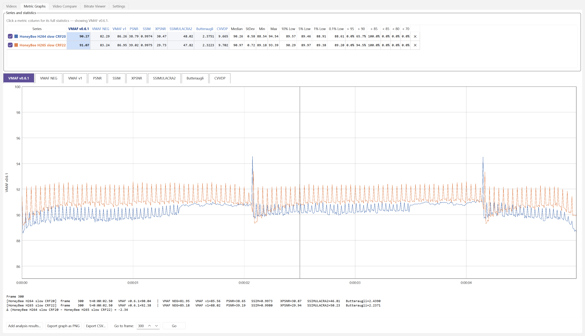

# VideoMetricsLab

A Windows desktop app for measuring and comparing video encode quality.

## Features

- Calculate VMAF, VMAF NEG, PSNR, SSIM, XPSNR, SSIMULACRA2, Butteraugli, and ColorVideo VDP for multiple test videos.
- Vship integration for GPU acceleration for ColorVideo VDP, SSIMULACRA2, and Butteraugli, on NVIDIA (CUDA), AMD (HIP) and any other GPU with a Vulkan driver
- GPU acceleration for VMAF v0.6.1 and VMAF NEG on NVIDIA GPUs (GeForce GTX 16 and RTX 20 series or newer), with a bundled libvmaf built with CUDA
- libjxl integration for CPU fallback for SSIMULACRA2, and Butteraugli (no CPU support for ColorVideo VDP)
- VMAF v0.6.1 and v1 models for standard, phone, 4K, and HFR viewing scenarios.
- Compare metric curves, statistics, and per-frame scores (per second for ColorVideo VDP).
- Switch instantly between the source and test videos during playback, hold **S** to show the source, or inspect exact frames.
- Inspect bitrate independently by frame, second, or GOP.
- Detect black bars and handle resolution mismatches automatically.
- Use GPU decoding with independent software fallback per input.
- Calculate two test videos in parallel on many-core CPUs.
- Auto save completed results and auto load results when matching videos are loaded again.

## Videos

Configure each test independently, inspect its codec and bitrate, and calculate
multiple quality metrics in one run.


## Metric graphs

Compare real per-frame curves and distribution statistics. The frame readout
shows both test values and their signed delta at the same moment.



## Video Compare

Switch instantly between the reference and test encodes during playback, or
seek to an exact frame for close inspection.


## Bitrate Viewer

Analyze video-only bitrate independently by frame, second, or GOP.


## Quick start

1. Select a reference video.
2. Add one or more test videos.
3. Choose the metrics to calculate.
4. Click **Calculate metrics**.

Results appear in the video table and Metric Graphs tab as each test finishes.
Video Compare and Bitrate Viewer can also be used without calculating metrics.

For detailed instructions, see the [User Guide](docs/USER_GUIDE.md).

## Install

### Packaged release

Download the Windows zip from the [latest release](https://github.com/4KVCD/VideoMetricsLab/releases/latest),
extract it, and run `VideoMetricsLab.exe`.

The app requires **FFmpeg 9 or newer with libvmaf**. FFmpeg is not bundled; the
app prompts for its location if it is not available on `PATH`.

### Run from source

Requires Python 3.11 or newer:

```powershell
py -3 -m venv .venv
.venv\Scripts\python.exe -m pip install -r requirements.txt
.venv\Scripts\python.exe -m vmaf_app.main
```

## Requirements

- Windows 10 or 11
- FFmpeg 9+ with `ffmpeg`, `ffprobe`, and `libvmaf`
- Optional NVIDIA, Intel, or AMD GPU for hardware decoding and the GPU metrics
- Python 3.11+ when running from source

## Development

```powershell
.venv\Scripts\python.exe -m pip install -r requirements-dev.txt
.venv\Scripts\python.exe -m pytest
.venv\Scripts\python.exe -m ruff check vmaf_app tests scripts
```

Build the distributable with `./scripts/build_release.ps1`. See the
[build guide](docs/BUILD.md) and [contributing guide](CONTRIBUTING.md) for more.

## Documentation

[User Guide](docs/USER_GUIDE.md) ·
[Troubleshooting](docs/TROUBLESHOOTING.md) ·
[Known Issues](docs/KNOWN_ISSUES.md) ·
[Architecture](docs/ARCHITECTURE.md) ·
[Changelog](CHANGELOG.md) ·
[Security](SECURITY.md)

## License

Licensed under the [MIT License](LICENSE). Copyright (c) 2026 **4KVCD**.
Third-party components retain their own licenses; see
[Third-Party Notices](docs/THIRD_PARTY.md).

## v1.1 changelog

- Added bundled Netflix VMAF v1.0 model files for standard, phone, 4K, and HFR analysis.
- Refactored metric execution around a shared registry and backend plan.
- Added per-metric results, provenance, and cache identities so saved results remain tied to their implementation and settings.
- Improved generalized metric graph and per-frame readout handling.

## v1.1.1 changelog

- Fixed the metric graph clipping VMAF v1 scores above 100.
- Show the application version in the window title: VideoMetricsLab 1.1.1.
- Omit calculation-library version metadata from non-VMAF cache entries

## v1.2 changelog

- Added GPU support for ColorVideo VDP, SSIMULACRA2, and Butteraugli with
  Vship integration.
- Added CPU fallback for SSIMULACRA2 and Butteraugli with libjxl. ColorVideo
  VDP has no CPU fallback.
- Added CVVDP per-second scores and graphing alongside its whole-video score.
- Added an Add/remove metrics control to the Videos tab so metric columns can
  be shown or hidden, and new metrics can be added to completed analyses
  without recalculating existing results.
- Included various small under-the-hood bug fixes and reliability improvements.

## v1.2.1 changelog

- Added a VMAF v1 column with its own model list. The existing VMAF column is
  now labelled VMAF v0.6.1, and scores saved by earlier versions still load.
  VMAF v1's Auto model is chosen by the resolution the videos are compared
  at: 4K and above uses the 4K / 1.5H model, because 1.5 screen heights is the
  standard viewing distance for 4K (VMAF v0.6.1's 4K model uses it too).
  Anything below 4K uses the 1080p / 3H model, the standard distance for HD.
- Reworked the run status: each video shows its CPU and GPU metrics progress
  separately, with elapsed time and a more accurate queue ETA, plus many
  related bug fixes.
- Cancelling a run will now keep the metrics a video had already finished.
- Cancelling a run will now stay on the Videos tab rather than jump to the
  Metric Graphs tab.
- Video Compare no longer re-checks the reference each time a different test
  video is picked.
- Fixed saved VMAF scores not loading on rows set to VMAF model Auto.
- Fixed the metrics ticked in the Videos tab column headers being unticked
  after a restart.
- Included various small bug fixes and reliability improvements.

## v1.3 changelog

- Added the window in 20 languages: Simplified and Traditional Chinese,
  Spanish, Brazilian Portuguese, German, French, Japanese, Russian, Korean,
  Italian, Polish, Turkish, Arabic, Indonesian, Vietnamese, Ukrainian, Thai,
  Czech, Hungarian and Dutch. The app opens in Windows' display language, and
  Settings > Window > Language chooses another. The log, saved results and
  exported files stay in English.
- Added Intel GPU support for the GPU metrics with Vship's Vulkan build, which
  runs on any GPU with a Vulkan driver. Settings > GPU metrics > GPU backend
  chooses the build: Auto (the default) uses CUDA on NVIDIA, HIP on AMD and
  Vulkan on other GPUs. On Vulkan, SSIMULACRA2 is calculated on the CPU,
  because Vship 5.1.1's Vulkan build scores it too high (up to 17 points at
  4K).
- Updated the GPU metrics to Vship 5.1's API and color handling. Videos tagged
  BT.2020 SDR, SMPTE 170M (NTSC/DVD), Display P3, ICtCp or YCgCo, and
  monochrome and alpha videos, are now scored on the GPU instead of falling
  back to the CPU, and CVVDP no longer fails on them. RGB videos without a
  transfer tag are now read as sRGB, as Vship's own FFVship does, and their
  saved GPU scores are recalculated.
- Added a setting to calculate SSIMULACRA2, Butteraugli and CVVDP together in one pass per video (Settings > GPU metrics, off by default). It's better GPU utilization for faster metrics calculations, and it decodes each video once instead of once per metric, but needs much more GPU memory.
- Each metric's score now appears and is saved as soon as it is done, instead
  of when the whole video is finished. Stopping a run or closing the app loses
  at most the metric in progress.
- Fixed test frames stamped slightly earlier than the source's being compared
  with the previous source frame, which gave clusters of near-zero VMAF NEG
  and XPSNR scores. Each test frame is now compared with the source frame
  nearest in time. Saved scores of affected videos are kept until they are
  recalculated.
- Hovering a red Failed cell now says why that metric failed.
- Added a session log under Settings > Storage > Log files, with Export log...
  (the log files as one .zip) and Copy log (the latest run) buttons.
- The app now checks GitHub for a newer release when it starts, and says so
  only if there is one. Turn it off in Settings > Window.
- Windows no longer goes to sleep while metrics are being calculated. The
  screen can still turn off.
- Included various small bug fixes and reliability improvements.

### Known issues in v1.3

- With Vship's Vulkan build (Intel GPUs, or GPU backend set to Vulkan),
  Butteraugli and CVVDP are wrong for videos tagged with SMPTE 170M or 240M
  primaries (NTSC/DVD), and Butteraugli is about 2.5% off for videos tagged
  BT.470BG and for untagged SD videos. CUDA and HIP are not affected.
- 4:1:0 (yuv410p) videos cannot be scored on the GPU: SSIMULACRA2 and
  Butteraugli fall back to the CPU, and CVVDP is not calculated.

## v1.4 changelog

- Added VMAF v0.6.1 and VMAF NEG on NVIDIA GPUs.
- GPU metrics now take frames straight from the GPU's video decoder (NVIDIA,
  Intel and AMD) instead of through FFmpeg, using much less CPU.
- Updated Vship's Vulkan build to 5.1.2, with SSIMULACRA2 on Intel GPUs.
- A crash in the GPU libraries no longer closes the app.
- Reworked the progress line, with each metric's progress and time remaining.
- VMAF NEG now sits beside VMAF v0.6.1.
- Fixed wrong SSIMULACRA2, Butteraugli and CVVDP scores for odd-sized AV1 and
  VP9 videos with GPU decoding on.
- Fixed SSIMULACRA2, Butteraugli and CVVDP comparing the wrong frames after a
  dropped frame.
- Fixed CPU SSIMULACRA2 and Butteraugli scores differing from the GPU's on SDR
  video. Saved CPU scores are recalculated once.
- Fixed 24 fps videos being accepted against 23.976 fps ones.
- Fixed Intel GPUs getting no GPU metrics.
- Fixed FFmpeg's GPU decoding not being used on AMD GPUs.
- Fixed an occasional crash at startup or when opening Video Compare.

### Minor bug fixes

- Fixed videos that end early being scored on the frames they have.
- Fixed XPSNR missing with frame subsampling and VMAF on the GPU.
- Fixed videos with a soundtrack longer than the picture failing with
  "Durations do not match".
- Fixed MP4 cover art being compared or played instead of the video.
- Fixed a crash on exit on PCs with a Vulkan loader but no Vulkan driver.
- Fixed adding videos whose name or title contains curly quotes or Chinese,
  Japanese or Korean text.
- Fixed the Video bitrate column showing the whole file's bitrate for MKV files.
- Fixed loading a saved run of a listed video adding a second row.
- Fixed the window opening wider than the screen in some languages.
- Fixed Video Compare's status line for references without a soundtrack.

### How VMAF on the GPU works

libvmaf, the library that calculates VMAF, has CUDA versions of the features
VMAF is made from (VIF, ADM and motion), but they can't simply be used. No
FFmpeg build the app can rely on includes them, and as merged they score
differently from the CPU: libvmaf's issues and pull requests report randomly
low motion scores, NaN VIF scores, and ADM differing from the CPU's at the
frame edges.

So VideoMetricsLab bundles its own libvmaf with CUDA, built from libvmaf
master ([cea2b4d8](https://github.com/Netflix/vmaf/commit/cea2b4d832a105116a3f16f56d6f5d953421952c))
with 12 open pull requests merged in, each pinned to the commit we tested:

- [#1477](https://github.com/Netflix/vmaf/pull/1477): a native Windows (MSVC)
  build.
- [#1573](https://github.com/Netflix/vmaf/pull/1573): CUDA build fixes, and a
  crash with pinned picture memory.
- [#1583](https://github.com/Netflix/vmaf/pull/1583): a race in the motion
  feature that gave randomly low motion scores, and a double flush at the end
  of a video.
- [#1644](https://github.com/Netflix/vmaf/pull/1644) and
  [#1612](https://github.com/Netflix/vmaf/pull/1612): motion at the frame
  edges, which now mirrors them as the CPU does, and on the first frame.
- [#1614](https://github.com/Netflix/vmaf/pull/1614): a race in VIF that gave
  NaN scores.
- [#1647](https://github.com/Netflix/vmaf/pull/1647) to
  [#1651](https://github.com/Netflix/vmaf/pull/1651): five places where ADM's
  CUDA code differed from the CPU's (contrast masking, rounding, border
  clamping, an angle constant and a denominator shift).
- [#1652](https://github.com/Netflix/vmaf/pull/1652): both frames released
  when one fails to score.

With them, VIF and ADM on the GPU are identical to the CPU's. Motion differs
by about 0.00003, because its CUDA kernel rounds its blur in a different
order ([libvmaf issue 1562](https://github.com/Netflix/vmaf/issues/1562),
not fixed yet). Every frame's VMAF is within 0.00006 of the CPU's, and VMAF
NEG within 0.0008, so a saved score is reused whichever calculated it.

`scripts/build_libvmaf_cuda.ps1` builds it from exactly these commits, and two
builds give the same file. libvmaf scores on the GPU in a process of its own,
so a crash in it or in the NVIDIA driver calculates that video's VMAF on the
CPU instead of closing the app.

Where NVIDIA's decoder can decode both videos, that process decodes them too:
the pictures are cropped, scaled and paired on the GPU and handed to libvmaf
there, without ever being copied to system memory. Otherwise FFmpeg decodes
and pairs the frames and pipes them to it. Either way the frames are paired
by timestamp exactly as FFmpeg's own libvmaf filter pairs them.

VMAF v1 (which has no CUDA version), custom models, resolution tests, 12-bit
videos and comparisons at an odd width or height stay on the CPU.

Thanks to the authors of these pull requests. We hope they are merged, so that
everyone gets accurate VMAF on the GPU.

### Known issues in v1.4

- On the integrated Intel GPU of a Core Ultra 9 285K, CVVDP fails on 4K videos
  ("A GPU Call failed inside Vship"). SSIMULACRA2 and Butteraugli are not
  affected.
- On HDR (PQ) video, SSIMULACRA2 on the CPU and on the GPU still differ
  widely (35 against 47 on one film): libjxl's tool handles HDR in its own
  way. Butteraugli agrees (2.89 against 2.88). Use the GPU score for HDR.
